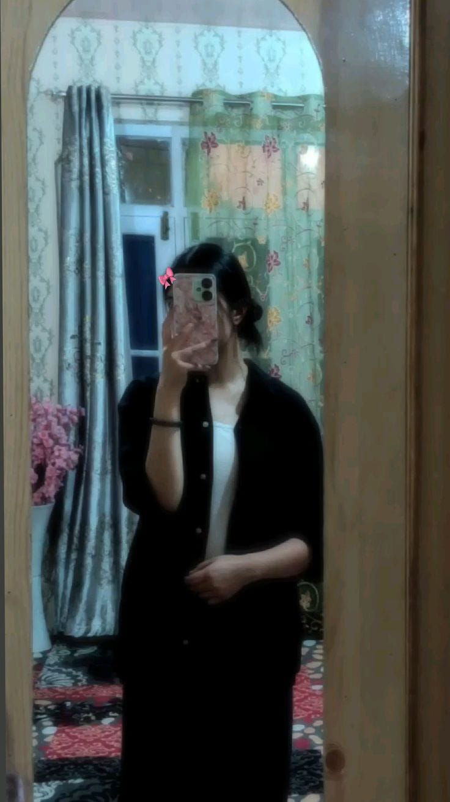

<!DOCTYPE html>
<html lang="ar" dir="rtl">
<head>
<meta charset="UTF-8">
<meta name="viewport" content="width=device-width, initial-scale=1.0">
<title>❤️ لينا</title>
<link href="https://fonts.googleapis.com/css2?family=Cairo:wght@400;700;900&display=swap" rel="stylesheet">
<link rel="stylesheet" href="https://cdnjs.cloudflare.com/ajax/libs/font-awesome/6.5.1/css/all.min.css">

</head>

<body>

<!-- 🎬 Intro -->

    

    
في حكاية بدأت من غير ما ناخد بالنا…

<!-- 🔐 Password -->

    
المكان ده لينا بس 🤍

    

        

        

            
1

2

3

            
4

5

6

            
7

8

9

            
0

        

    

    

<!-- 💌 -->

<!-- 😏 -->

    
مش هتعدي غير لما تديني بوسة 😏

    

        <button class="icon-btn" onclick="kiss()">
            <i class="fa-solid fa-lips"></i> امواااه
        </button>
        <button class="icon-btn" id="runawayBtn" style="background: linear-gradient(135deg, #6c757d, #495057);">
            <i class="fa-solid fa-face-frown"></i> لا مش هديك
        </button>
    

<!-- 🎵 -->

    
دوسي هنا عشان تسمعي قلبنا 🎧

    <audio id="song" src="song.mp3"></audio>
    <button class="icon-btn" onclick="playSong()">
        <i class="fa-solid fa-play"></i> تشغيل
    </button>

<!-- 🖼️ -->

    

<!-- 📖 -->

    

        

    

    <button class="icon-btn" onclick="nextPage()">
        <i class="fa-solid fa-book-open"></i> اقلب الصفحة
    </button>

<!-- ⏳ -->

    <h2 class="counter-title">الوقت اللي قضيناه مع بعض ⏳</h2>
    

        

            
0

            
يوم

        

        

            
0

            
ساعة

        

        

            
0

            
دقيقة

        

        

            
0

            
ثانية

        

    

    <button class="icon-btn" onclick="love()">
        <i class="fa-solid fa-heart"></i> بتحبني قد اي
    </button>
    

<script>
// 🎬 intro
setTimeout(() => {
    document.getElementById("intro").style.display = "none";
    document.getElementById("lock").style.display = "flex";
}, 3000);

// 🔐 password
let pass = "2024326";
let input = "";
document.querySelectorAll(".key").forEach(k => {
    k.onclick = () => {
        if (input.length >= pass.length) return;
        input += k.innerText;
        document.getElementById("display").innerText = "*".repeat(input.length);

        if (input.length == pass.length) {
            if (input == pass) {
                document.getElementById("lock").style.display = "none";
                startMessage();
            } else {
                document.getElementById("error").innerText = "غلط 😏 ركزي";
                input = "";
                setTimeout(() => {
                    document.getElementById("display").innerText = "";
                    document.getElementById("error").innerText = "";
                }, 1000);
            }
        }
    }
});

// 💌 typing
let text = [
    "فاكرة أول مرة اتكلمنا فيها؟",
    "أنا بحبك بطريقة مش بعرف أشرحها",
    "بس بحسها كويس أوي ❤️",
    "كملي معايا…"
];
let i = 0;
function startMessage() {
    document.getElementById("message").style.display = "flex";
    type();
}
function type() {
    if (i < text.length) {
        let p = document.createElement("p");
        p.innerText = text[i];
        p.style.opacity = "0";
        p.style.transition = "1s";
        document.getElementById("message").appendChild(p);
        setTimeout(() => p.style.opacity = "1", 100);
        i++;
        setTimeout(type, 2000);
    } else {
        setTimeout(() => {
            document.getElementById("message").style.display = "none";
            document.getElementById("kiss").style.display = "flex";
        }, 2000);
    }
}

// 😏 kiss
let k = 0;
function kiss() {
    k++;
    for (let i = 0; i < 30; i++) {
        let h = document.createElement("div");
        h.className = "heart";
        h.innerText = "❤️";
        h.style.left = Math.random() * 100 + "%";
        h.style.fontSize = (Math.random() * 20 + 10) + "px";
        document.body.appendChild(h);
        setTimeout(() => h.remove(), 2000);
    }
    if (k == 3) {
        document.getElementById("kiss").style.display = "none
